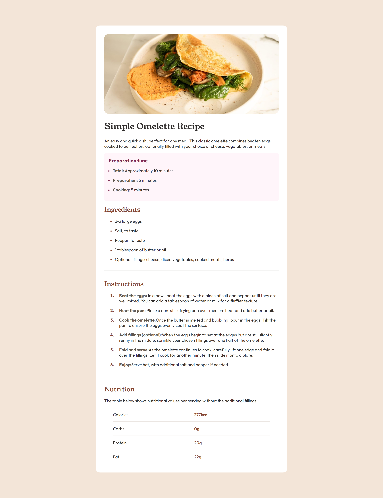

# Frontend Mentor - Recipe page solution

This is a solution to the [Recipe page challenge on Frontend Mentor](https://www.frontendmentor.io/challenges/recipe-page-KiTsR8QQKm). Frontend Mentor challenges help you improve your coding skills by building realistic projects.

## Table of contents

- [Overview](#overview)
  - [Screenshot](#screenshot)
  - [Links](#links)
- [My process](#my-process)
  - [Built with](#built-with)
  - [What I learned](#what-i-learned)
  - [Useful resources](#useful-resources)
- [Author](#author)

## Overview

### Screenshot



### Links

- Solution URL: [Add solution URL here](https://maryammoshtoofar.github.io/recipe-page)
- [CodePen](https://codepen.io/maryammoshtoofar/pen/zYbRVox)

## My process

### Built with

- Semantic HTML5 markup
- CSS custom properties
- Flexbox

### What I learned

- How to change the color of hr tag

```css
hr {
  border-color: var(--light-grey);
}
```

- declare variables in CSS

```css
:root {
  --nutmeg: #854632;
  --dark-raspberry: #7b284f;
  --white: #ffffff;
  --rose-white: #fff5fa;
  --eggshell: #f3e5d8;
  --light-grey: #e4ded8;
  --wenge-brown: #5f574e;
  --dark-charcoal: #302d2c;
}
```

- how to change the color of list items using ::marker pseudo-element

```css
li::marker {
  color: var(--nutmeg);
}
```

### Useful resources

- [CSS Tricks gap after list marker](https://css-tricks.com/everything-you-need-to-know-about-the-gap-after-the-list-marker/) - This is a great article and helped me handle the gaps I needed to create after the list marker


## Author

- Website - [Maryam Moshtoofar](https://maryammoshtoofar.github.io/)
- Frontend Mentor - [@maryammoshtoofar](https://www.frontendmentor.io/profile/maryammoshtoofar)
- CodePen - [@maryammoshtoofar](https://codepen.io/maryammoshtoofar)
